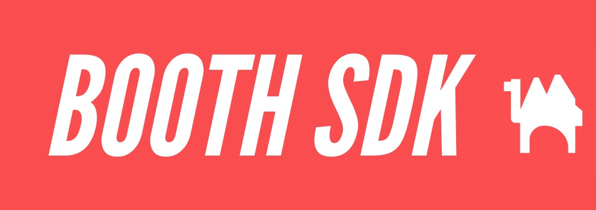

# **[Booth.pm](http://booth.pm/) 非公式API**

## **概要**

<a href="http://booth.pm">Booth.pm</a> Scraper APIは、人気のある電子商取引プラットフォーム Booth.pm から情報を抽出するためのウェブスクレイピングツールです。このAPIを使用すると、サイトで利用可能なすべての無料アイテムに関する詳細を取得し、それらをダウンロードする機能を提供します。

## **貢献**

私たちは Booth.pm Scraper APIの機能と使いやすさを向上させるための貢献を歓迎します。バグを見つけた場合、機能の要望がある場合、またはコードを貢献したい場合は、私たちの[貢献ガイドライン](https://chat.openai.com/c/CONTRIBUTING.md)に従ってください。

## **ライセンス**

このプロジェクトはMITライセンスの下でライセンスされています - 詳細はLICENSEファイルを参照してください。
